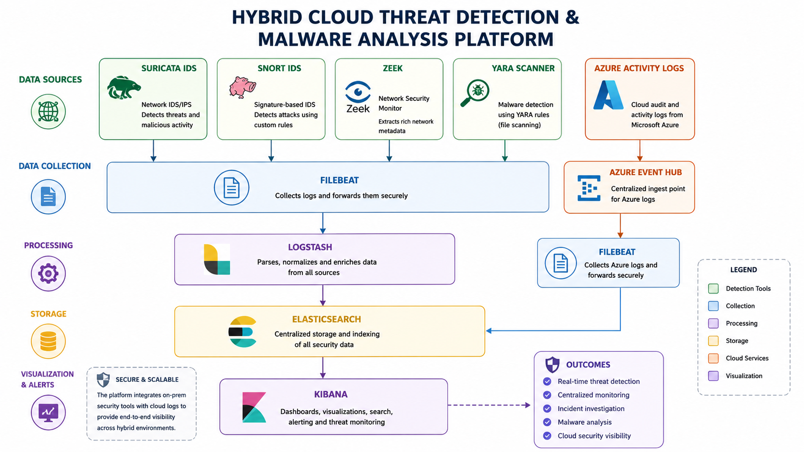
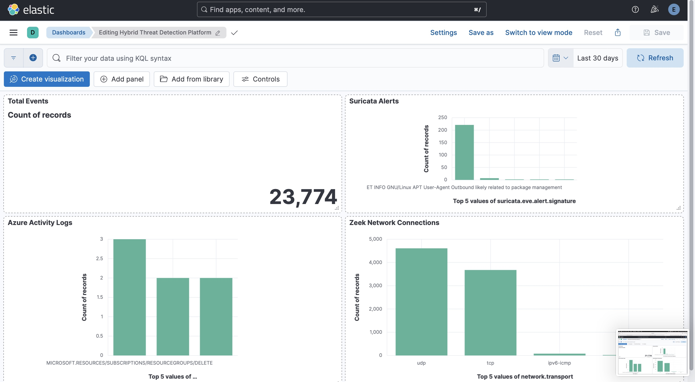
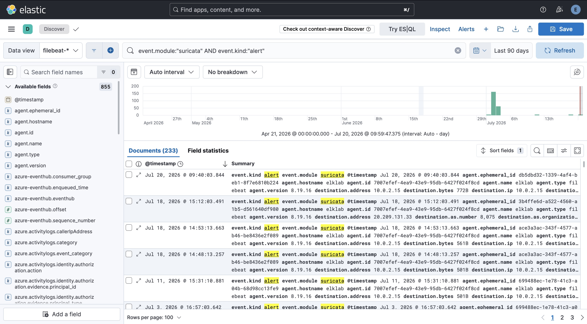
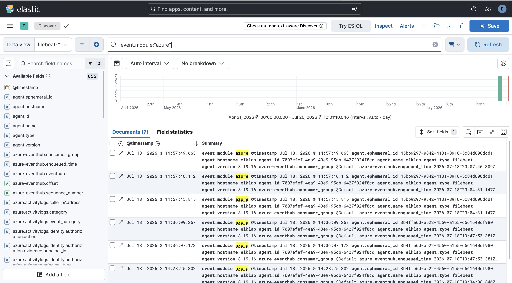
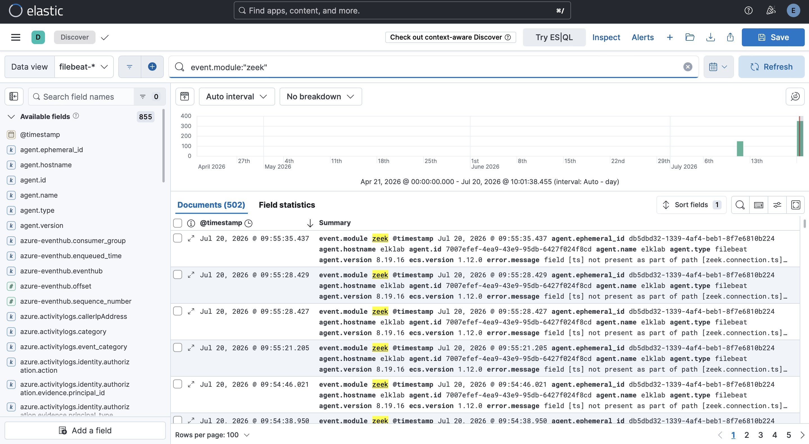
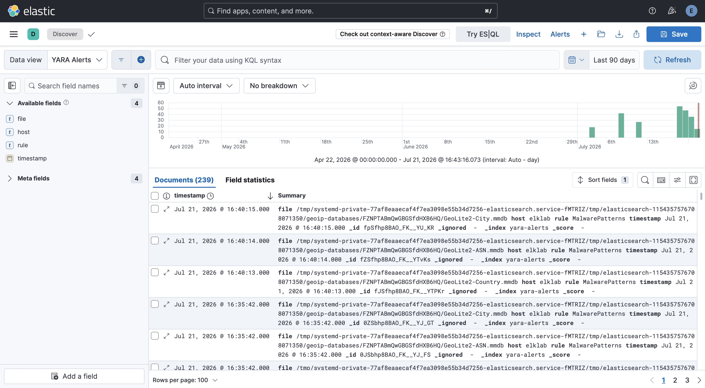
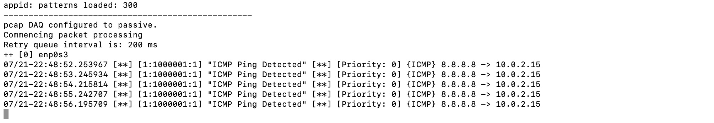

# Hybrid Cloud Threat Detection & Malware Analysis Platform

A comprehensive Security Information and Event Management (SIEM) platform that integrates network intrusion detection, malware analysis, cloud security monitoring, and centralized log management using the Elastic Stack and multiple open-source security tools.

---

## Project Overview

This project demonstrates the implementation of a hybrid cloud security monitoring platform capable of collecting, processing, analysing, and visualising security events from both on-premises and cloud environments.

The platform integrates multiple cybersecurity technologies into a unified monitoring solution that enables real-time threat detection, incident investigation, malware analysis, and security event correlation.

The project was developed on Ubuntu Server using the Elastic Stack (Elasticsearch, Logstash, Kibana, and Filebeat) together with Suricata, Snort, Zeek, YARA, and Microsoft Azure Activity Logs.

---

## Key Features

- Centralised Security Information and Event Management (SIEM)
- Real-time log collection and forwarding
- Network intrusion detection using Suricata
- Signature-based intrusion detection using Snort
- Network traffic analysis with Zeek
- Malware detection using custom YARA rules
- Microsoft Azure Activity Log integration
- Interactive Kibana security dashboards
- Security event correlation and investigation
- Threat hunting capabilities

---

## Technology Stack

| Technology | Purpose |
|------------|---------|
| Ubuntu Server | Operating System |
| Elasticsearch | Log Storage & Search |
| Logstash | Log Processing Pipeline |
| Kibana | Data Visualisation |
| Filebeat | Log Collection |
| Suricata | Network Intrusion Detection System |
| Snort | Signature-Based Intrusion Detection |
| Zeek | Network Security Monitoring |
| YARA | Malware Detection |
| Microsoft Azure | Cloud Activity Monitoring |

---

## System Architecture



---

## Repository Structure

```text
Hybrid-Cloud-Threat-Detection-Platform/
│
├── README.md
├── PROJECT_REPORT.pdf
│
├── diagrams/
│   └── architecture-diagram.png
│
├── elk-stack/
│   ├── logstash.conf
│   ├── filebeat.yml
│   └── kibana.yml
│
├── intrusion-detection/
│   ├── suricata.yml
│   └── local.rules
│
├── malware-detection/
│   ├── malware.yar
│   ├── yara-scan.sh
│   └── zeek.yml
│
├── cloud-security/
│   └── azure.yml
│
└── screenshots/
    ├── 01-unified-dashboard.png
    ├── 02-suricata-alerts.png
    ├── 03-azure-logs.png
    ├── 04-zeek-overview.png
    ├── 05-yara-alerts.png
    └── 06-snort-terminal.png
```

---

## Screenshots

### Unified Security Dashboard



---

### Suricata Alerts



---

### Azure Activity Logs



---

### Zeek Network Monitoring



---

### YARA Malware Detection



---

### Snort Intrusion Detection



---

## Skills Demonstrated

- Security Information and Event Management (SIEM)
- Security Operations Centre (SOC)
- Threat Detection and Monitoring
- Incident Response
- Network Security Monitoring
- Malware Analysis
- Intrusion Detection
- Threat Hunting
- Cloud Security Monitoring
- Log Collection and Correlation
- Linux System Administration
- Microsoft Azure Monitoring
- Security Dashboard Development

---

## Future Improvements

- Automated Incident Response (SOAR)
- Threat Intelligence Feed Integration
- MITRE ATT&CK Framework Mapping
- Email and Slack Alerting
- Machine Learning-Based Anomaly Detection
- Docker Deployment
- Kubernetes Deployment
- Multi-node Elasticsearch Cluster

---

## Technical Report

A detailed technical report documenting the implementation process, system architecture, testing methodology, challenges encountered, and lessons learned is included in this repository.

📄 **[PROJECT_REPORT.pdf](PROJECT_REPORT.pdf)**

---

## Author

**Mola Faith Etchie**

Cybersecurity Analyst | SOC Analyst | Incident Response

GitHub: https://github.com/MolaEtchie

---

## License

This project is intended for educational, research, and professional portfolio purposes.
